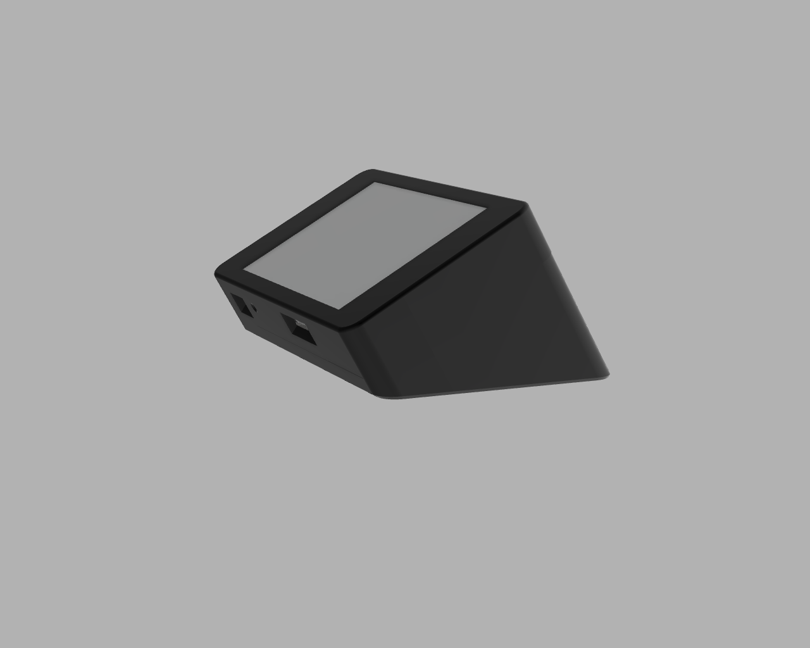

# The Case

The case for the ESP32 TouchDown comes in two parts. The front is the same for every style of case you want. The back comes in four variants; a flush cover, a cover with a battery compartment, a back that has the same wedge style as [FreeTouchDeck](https://github.com/DustinWatts/FreeTouchDeck), and a similar style but at an angle of 30°.

You will also find the .f3z file so you can import the case in Fusion360 and modify it to your liking.

# The Front
This part is the same for all.

(file: ESP32_TouchDown_Front.stl)
# The Flush Back
With four holes for mounting.

(file: ESP32_TouchDown_Flush.stl)
# The Battery Back
Which comfortably fits a 2000mAh battery.

(file: ESP32_TouchDown_Battery.stl)
# The FreeTouchDeck-style Back
Like the case for FreeTouchDeck.

(file: ESP32_TouchDown_FTD.stl)
# The 30° angled FreeTouchDeck-style Back
Like the case for FreeTouchDeck but at an angle of 30°.

(file: ESP32_TouchDown_FTD_30.stl)
# More cases on Thingiverse

Also check out the cases made by ESP32 TouchDown users:  https://www.thingiverse.com/search?q=esp32+touchdown

